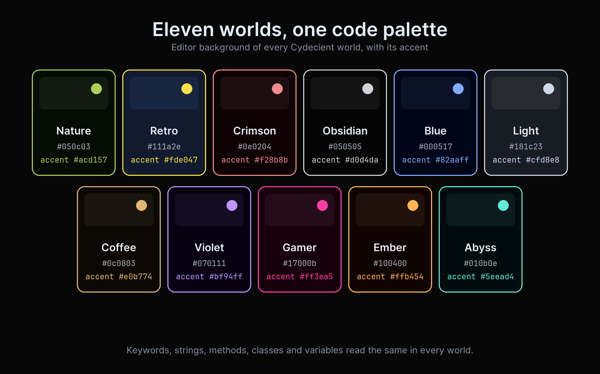

# Cydecient Dark Themes

**Eleven dark worlds. One code palette.**

I got tired of looking for a dark theme. Most of them are hazy: grey on grey, washed-out pastels, backgrounds that never go truly dark, and syntax colors that change every time you switch. Cydecient Dark Themes is the fix I wanted: eleven deep, saturated dark worlds, from matte forest green to neon arcade pink, and in every one of them the code colors are the [One Dark Blue](https://marketplace.visualstudio.com/items?itemName=PhilipEze.one-dark-blue) palette, untouched. White variables, no italics, everything lit and razor-sharp on near-black. Pick a world for the mood you are in; your highlighting stays exactly where your eyes learned it.

If you came here from One Dark, One Dark Pro or One Dark Blue, the code will feel familiar at once; if you came looking for a dark green, dark blue, OLED black, purple, neon pink, red, orange, brown, teal or navy theme, there is a world here in that color, and they all read the same.

## Worlds

Every world keeps the same code colors. What changes is the world around them: the editor background, the side bar, panels, tabs, borders, selections and the accent.

### Cydecient Nature

Background `#050c03`, accent `#acd157`. Matte forest green, the world every other is tuned against. A moss-dark canvas that makes lime strings and gold types glow like undergrowth catching light. Calm, grounded, the one you can live in from morning to last commit.

### Cydecient Retro

Background `#111a2e`, accent `#fde047`. Deep midnight navy lit by warm amber, the glow of an old terminal under a blueprint lamp. Cool and a little nostalgic, with just enough yellow to feel analog without ever going bright.

### Cydecient Crimson

Background `#0e0204`, accent `#f28b8b`. Dark red, ember-lit. A low, intense world for heads-down focus, like working by the light of coals. Coral accents keep it warm rather than harsh.

### Cydecient Obsidian

Background `#050505`, accent `#d0d4da`. Near-pure black volcanic glass, with translucent grey island edges that let your panels float. The most minimal, highest-contrast world in the pack: nothing between you and the code.

### Cydecient Blue

Background `#000517`, accent `#82aaff`. The deep-space midnight of One Dark Blue, the VS Code theme this whole pack grew from. Cool, quiet, timeless, the classic dark that never tires.

### Cydecient Light

Background `#181c23`, accent `#cfd8e8`. The softest dark: a moonlit graphite for overcast afternoons and bright rooms. Still fully dark and still code-first, just a gentler night. Not a milky light theme; the code colors never change.

### Cydecient Coffee

Background `#0c0803`, accent `#e0b774`. Dark roast brown, warm and close, an espresso-lit study where caramel accents rest on cocoa shadow. Cozy without ever going soft.

### Cydecient Violet

Background `#070111`, accent `#bf94ff`. Deep violet dusk, a saturated purple world for late, creative sessions. Neon-adjacent, a little electric, the kind of dark you disappear into.

### Cydecient Gamer

Background `#17000b`, accent `#ff3ea5`. Neon pink on black with glowing island edges, synthwave and arcade cabinet and 2am energy. The loudest world here, and proud of it.

### Cydecient Ember

Background `#100400`, accent `#ffb454`. Deep amber and burnt orange, a forge at dusk. Warm light pooling on dark iron, for anyone who finds blue themes cold.

### Cydecient Abyss

Background `#010b0e`, accent `#5eead4`. Deep ocean teal, submerged and cool and quiet, a mile down. Aqua accents drift over near-black water, a calm counterpart to the green.

## Install

1. Extensions view (Ctrl+Shift+X), search **Cydecient Dark Themes**, Install.
2. Ctrl+K Ctrl+T, then pick any Cydecient world.

## What changes per world, and what never changes

Only the workbench changes: the editor background, the side bar, panels, tabs, borders, selections and the accent color. Keywords, strings, methods, classes and variables are identical in every world, so switching worlds never means relearning a color.

Every panel shares the editor's exact background, the line numbers, indent guides, selections and diff colors are tuned per world, and the active tab and the panel title carry the world's accent.

## License

Copyright 2026 Phil Ezevia. All rights reserved. Free to use; see LICENSE.
